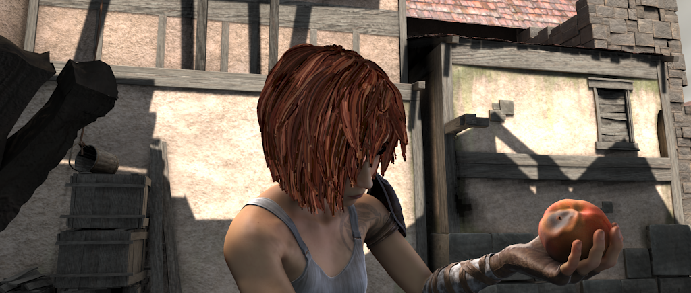
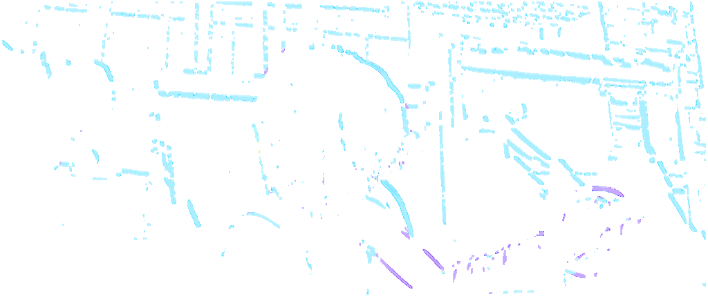

# Final-Project-Optical-Flow

Team7 HLS Final Project  

## Major Optimization
* Streaming dataflow optimization 
* Pipeline Optimization
* Data Pack
* HLS Dataflow, which allowing functions and loops to overlap in their operation, increasing the concurrency of the RTL implementation.

## Folder Structure
 
|&emsp; -- build/&emsp;&emsp;&emsp;&emsp;&emsp;		    # build scripts  
|&emsp; -- data/			  
|&emsp;    |&emsp; -- dataset_1/&emsp;&ensp;		# dataset_1  
|&emsp;    |&emsp; -- dataset_2/&emsp;&ensp;		# dataset_2  
|&emsp;    |&emsp; -- MP4-video-to-PPM-batch-converter/   
|&emsp; -- docs/ &emsp;&emsp;&emsp;&emsp;&emsp;			# Slide of this project  
|&emsp; -- impl_result/ &emsp;&emsp;&ensp;# HLS synth report  
|&emsp; -- src/&emsp;&emsp;&emsp;&emsp;&emsp;&emsp;  # Source files  
|&emsp;    |&emsp; -- host/&emsp;&emsp;&emsp;&emsp;		# host code  
|&emsp;    |&emsp; -- original/&emsp;&emsp;&ensp;	# Code Without optimization  
|&emsp;    |&emsp; -- kernel_opt1/&ensp;&ensp;	# kernel code with optimization opt1 – note: use in-line pragma  	  
|&emsp;    |&emsp; --  README.md  
|&emsp; -- tests/  
|&emsp; -- LICENSE &emsp;&emsp;&emsp;&emsp;# License fiel, we use MIT License (refer to last page of the ppt)  
|&emsp; -- README.md &emsp;&emsp;		# overview of the project 

## How to produce your own Dataset ???
Current kernel take five consecutive frames as input. To test optical flow on your own video, you'll have to convert mp4 to ppm manually.

1. Convert mp4 to ppm  
We refer to this github page [MP4-video-to-JPG-batch-converter](https://github.com/jasonmayes/MP4-video-to-JPG-batch-converter)  
Shell script is in [data/MP4-video-to-PPM-batch-converter](https://github.com/yuweitt/Final-Project-Optical-Flow/tree/main/data/MP4-video-to-PPM-batch-converter)

2. Conver flo to mp4 or png  
We refer to this github page [flowiz](https://github.com/georgegach/flowiz)   
  
    * Install flowiz  
`$pip install flowiz -U`  
    * FLO Conversion  
    `demo/png` is output dir of png, and `demo/mp4` is output dir of mp4 file.  
`$python -m flowiz demo/flo/*.flo -o demo/png --videodir demo/mp4`

If needed, resize your image with opencv to reach higher frame rate.

## Build Step
Build new HLS project with provided source file and tcl script.  
Environment: Vivado HLS 2019.2 

## Result Demo

* Input Image (With five consecutive Frames)
  

* Output Image
  

Demo Vido is available on [here](https://drive.google.com/drive/u/0/folders/1aZEH42efPpHFc-OHz4QsEv5FFpby9B18).